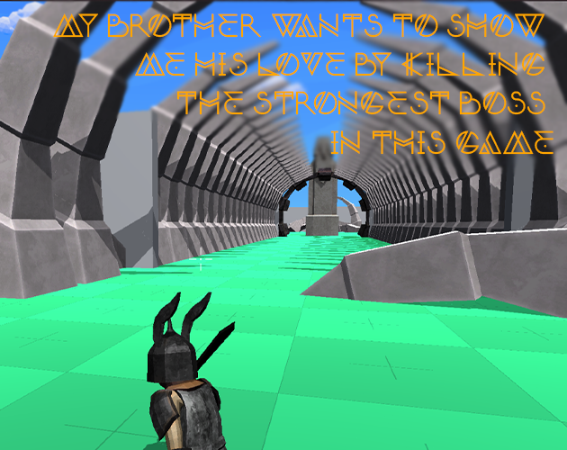

# [My brother wants to show me his love by killing the strongest boss in this game](https://teamon.itch.io/mbwtsmhlbktsbitg)
Made in 72 hours for [Global Game Jam 2022](globalgamejam.org)  
Theme: Duality  

3D third-person roguelite

 

# Key features
 * Third person battle system
 * Random level generator
 * Pickups with buff condition
 * Groups enemy AI

# What is Global Game Jam?
The Global Game Jam is the world's largest game jam event taking place around the world at physical locations. Think of it as a hackathon focused on game development. It is the growth of an idea that in today’s heavily connected world, we could come together, be creative, share experiences and express ourselves in a multitude of ways using video games – it is very universal. The weekend stirs a global creative buzz in games, while at the same time exploring the process of development, be it programming, iterative design, narrative exploration or artistic expression. It is all condensed into a 48 hour development cycle. The GGJ encourages people with all kinds of backgrounds to participate and contribute to this global spread of game development and creativity. [More here...](https://globalgamejam.org/about)

# Diversifiers
 * Share the source code of your project

# Credits
 * [Team-on](https://github.com/Team-on) - programmer
 * [Bohdan_Ukraine](LINK) - programmer
 * [Lighthammer](LINK) - game design
 * [HappyTan](LINK) - 3D art
 * [Elvisinside](LINK) - sounds

# Used tools
 * Unity 2020.2.0f1
 * Visual Studio 2019
 * Adobe Photoshop 2020
 * Audacity

# Used assets
 * Unity game template - https://github.com/Team-on/UnityGameTemplate
 * Assets from template - https://github.com/Team-on/UnityGameTemplate/wiki/Used-assets
 * Animations from - https://www.mixamo.com/
 * 3D person controller + move animations - https://assetstore.unity.com/packages/tools/game-toolkits/third-person-controller-basic-locomotion-free-82048
 * https://freesound.org/people/fisu/sounds/350770/ - melee hit
 * https://freesound.org/people/saturdaysoundguy/sounds/391446/ -  melee miss
 * https://freesound.org/people/magnuswaker/sounds/528263/ - range hit
 * https://freesound.org/people/FilmmakersManual/sounds/522308/ - range hit
 * https://freesound.org/people/FilmmakersManual/sounds/522505/ - range hit
 * https://freesound.org/people/FilmmakersManual/sounds/522307/ - range hit
 * https://freesound.org/people/FilmmakersManual/sounds/522390/ - range miss
 * https://freesound.org/people/FilmmakersManual/sounds/522277/ - range miss
 * https://freesound.org/people/FilmmakersManual/sounds/522280/ - range miss
 * https://freesound.org/people/FilmmakersManual/sounds/522279/ - range start attack
 * https://freesound.org/people/vox_artist/sounds/513621/ - enemy die
 * https://freesound.org/people/Daleonfire/sounds/406113/ - hero die
 * https://freesound.org/people/ryusa/sounds/531082/ - heal
 

 
# Downloads and Links
Available in [Windows, OSX, Linux and Web](https://teamon.itch.io/mbwtsmhlbktsbitg).  
Consider downloading a game instead of playing the web version for better performance and stability.  
If you encounter any problem, please leave a issue!  

#### Mac Version Notes:
If you get "this package is from an unidentified developer" right click (or control-click) and select open. You should now get the option to open anyways.

#### Linux Version Notes:
Make sure to set the x86_64 as executable before running.

# Screenshots
  
  
  
